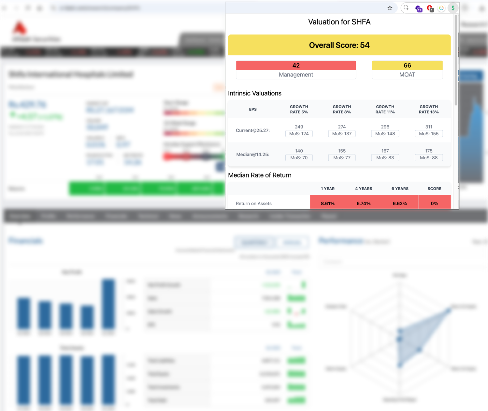

# Intrinsic Value Calculator Chrome Extension

Intrinsic Value Calculator is a Chrome extension designed to help users evaluate stock valuations directly on the Al-Falah brokerage platform. It provides detailed metrics and insights like intrinsic value, growth rates, and valuation ratios, making it a valuable tool for investors.

The intrinsic value is calculated using the median of growth metrics for Revenue, EPS, BVPS, etc. That valuation is then fed into a discounted cash flow to arrive at the fair value of the stock.

---

## Features

- **Intrinsic Value Calculation**: Determine the fair value of a stock based on its financial metrics.
- **Growth Rate Analysis**: Visualize and understand the company's growth rate.
- **Valuation Ratios**: Access PEG, P/E ratios, and other financial valuation metrics.
- **Sensitivity Table**: Interactive table to analyze intrinsic value under various assumptions.
- **Debt Profile & Current Ratio**: Assess the financial health of a company.
- **CAGR Calculator**: Analyze compound annual growth rates for consistent performance tracking.
- **Clean, User-Friendly UI**: Easily navigate metrics and insights via an intuitive interface.

---

## Screenshot



---

## Manual Installation Guide

Since this extension is not currently available in the Chrome Web Store, you can install it manually. Follow these steps:

1. **Download or Clone the Repository**

   - Download the repository as a ZIP file or clone it using Git:
     ```bash
     git clone https://github.com/your-repo/intrinsic-value-calculator.git
     ```

2. **Extract the Files**

   - If you downloaded the ZIP, extract the contents to a folder on your computer.

3. **Build the Extension**

   - Ensure you have [Node.js](https://nodejs.org/) installed on your system.
   - Navigate to the directory where the extension is located:
     ```bash
     cd /path/to/intrinsic-value-calculator
     ```
   - Install the required dependencies:
     ```bash
     npm install
     ```
   - Build the extension:
     ```bash
     npm run build
     ```

4. **Load the Extension in Chrome**

   - Open Chrome and navigate to `chrome://extensions/`.
   - Enable **Developer Mode** (toggle in the top-right corner).
   - Click on **Load unpacked** and select the `dist` folder generated in the extension directory after building.

5. **Activate the Extension**
   - Once loaded, the extension icon will appear in the Chrome toolbar.
   - Navigate to the Al-Falah brokerage platform to start using the Intrinsic Value Calculator.

---

## Customizing for Other Brokerages or Stock Websites

To repurpose the Intrinsic Value Calculator Chrome extension for other brokerages or stock websites, you need to customize the `contentScript.ts` file. This script is responsible for extracting data from the web page and processing it for the extension. Follow these steps to adapt the script to your target website:

### Steps to Customize `contentScript.ts`

1. **Identify the Data Source**

   - Inspect the target website to understand where the relevant data (e.g., stock metrics, financial ratios) is located. Use browser developer tools (F12) to inspect the HTML structure.

2. **Update the Data Extraction Logic**

   - Modify the selectors in `contentScript.ts` to match the HTML structure of the target website. For example, if the data is in a different table or div, update the query selectors accordingly.

   ```typescript
   // Example: Update the selector to match the target website's table structure
   const tableRows = document.querySelectorAll('new-table-selector tbody tr');
   ```

3. **Adjust the Data Processing Logic**

   - Ensure that the data processing logic aligns with the format of the extracted data. If the data structure differs, you may need to adjust how the data is parsed and stored.

   ```typescript
   // Example: Adjust data parsing logic
   const metricsKeywords = Object.entries(metrics).map(([key, metric]) => ({
   	key,
   	keywords: metric.newMatches.split(',').map((kw) => kw.trim()),
   }));
   ```

4. **Test the Changes**

   - Load the modified extension in Chrome and navigate to the target website. Verify that the data is being extracted and processed correctly. Check the console for any errors and debug as needed.

5. **Refine and Optimize**

   - Refine the extraction and processing logic to handle edge cases and improve performance. Ensure that the extension works seamlessly with the target website.

### Example Customization

Below is an example of how you might customize the `contentScript.ts` file for a different brokerage website:

```typescript
import {
	LocalStorage,
	MetricsObject,
	getStoredFields,
	setStoredFields,
} from '../storage/storage';

getStoredFields().then((metrics: MetricsObject) => {
	// Convert each metric's matches (comma-separated keywords) into an array for easier lookup
	const metricsKeywords = Object.entries(metrics).map(([key, metric]) => ({
		key,
		keywords: metric.matches.split(',').map((kw) => kw.trim()), // Trimmed keywords to avoid leading/trailing spaces
	}));

	const extractValues = () => {
		// Update the selector to match the target website's table structure
		const tableRows = document.querySelectorAll('new-table-selector tbody tr');

		if (!tableRows.length) {
			setStoredFields(null); // Clear metrics if no rows found
			return;
		}

		// Initialize result object, setting each metric's values as an empty array for storage
		const result: MetricsObject = Object.keys(metrics).reduce((acc, key) => {
			acc[key] = { ...metrics[key], values: [] };
			return acc;
		}, {} as MetricsObject);

		// Iterate over each row and extract relevant data
		tableRows.forEach((row) => {
			const cells = row.querySelectorAll('td');
			metricsKeywords.forEach(({ key, keywords }) => {
				keywords.forEach((keyword) => {
					// Check if the first cell contains the keyword
					if (cells[0].innerText.includes(keyword)) {
						// Push the value from the second cell to the result
						result[key].values.push(cells[1].innerText);
					}
				});
			});
		});

		setStoredFields(result); // Store the extracted values
	};

	extractValues(); // Execute the extraction function
});
```

By following these steps and customizing the `contentScript.ts` file, you can adapt the Intrinsic Value Calculator Chrome extension to work with other brokerages or stock websites.

---

## Technical Details

### Directory Structure

- **`src`**: Contains all source files, including components, scripts, and styling.
  - **`background`**: Background scripts to manage Chrome API interactions.
  - **`components`**: Modular React components for metrics, UI, and analysis.
  - **`contentScript`**: Script injected into web pages to interact with DOM elements.
  - **`options` & `popup`**: Extension's options and popup UI.
  - **`static`**: Static assets like icons and the `manifest.json`.
  - **`utils`**: Utility functions for calculations and data processing.

### Key Tools & Technologies

- **React**: Component-based UI development.
- **TypeScript**: Type-safe JavaScript for better scalability.
- **Webpack**: Efficient bundling for optimized performance.
- **Tailwind CSS**: Utility-first CSS framework for styling.
- **Node.js**: For dependency management and build process.

---

## Contributing

Contributions are welcome! Feel free to submit issues or pull requests for bug fixes or new features.

1. Fork the repository.
2. Create a new branch:
   ```bash
   git checkout -b feature-name
   ```
3. Commit your changes:
   ```bash
   git commit -m "Add new feature"
   ```
4. Push to the branch:
   ```bash
   git push origin feature-name
   ```
5. Open a pull request.

---

## License

This project is licensed under the MIT License.
